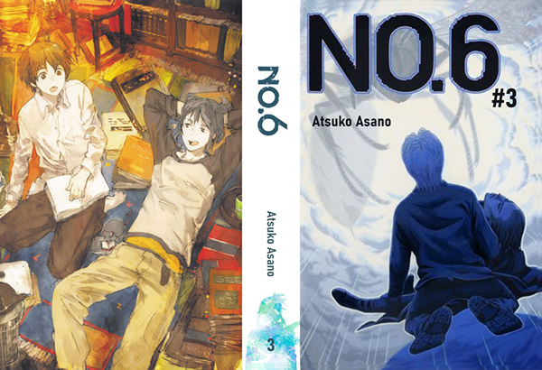

## No. 6 English translations

These are English translations for the novel *No. 6* by Atsuko Asano, as PDF files suitable for a print-on-demand service.

- [**Download**](https://github.com/ekuiter/no6-translations/archive/master.zip) all books and cover art
- Find the original translations here: http://9th-ave.blogspot.com/p/no-6.html
- Report mistakes and feedback via the issue tracker or via mail: info@elias-kuiter.de

### The story

The books are available as PDF files in the `pdf` directory.
The LaTeX source code for typesetting the books is available in the `tex` directory (the PDFs were created with `LuaLaTeX, Version 1.10.0 (TeX Live 2019/W32TeX)`).

I prepared two editions of the story:

- ... a **one-part edition**: [**PDF**](pdf/no6.pdf), [TEX](tex/no6.tex) (Volume I-IX, Beyond, side stories, afterwords)
- ... an edition in three parts, which is better-suited for printing:
  - **Part One**: [**PDF**](pdf/no6-part1.pdf), [TEX](tex/no6-part1.tex) (Volume I-III)
  - **Part Two**: [**PDF**](pdf/no6-part2.pdf), [TEX](tex/no6-part2.tex) (Volume IV-VI)
  - **Part Three**: [**PDF**](pdf/no6-part3.pdf), [TEX](tex/no6-part3.tex) (Volume VII-IX, Beyond, side stories, afterwords)

### Cover art

I also created covers (suitable for the three-part edition) based on Toru Kageyama's original novel art.
The art is available as PNG files in the `cover` folder. The Photoshop files are available [here](https://github.com/ekuiter/no6-translations/releases) (they are too large for the repository).

### Printing

If you want to print the books for yourself, the layout (135 x 205 mm) matches that of the *notebook* size available at [epubli](http://epubli.de).
Printing the book in other layouts should also be possible (change layout settings in `tex/setup.tex`), but bear in mind that I hand-tuned some details for this size. You may also need to edit the covers because the spine width will probably change.
